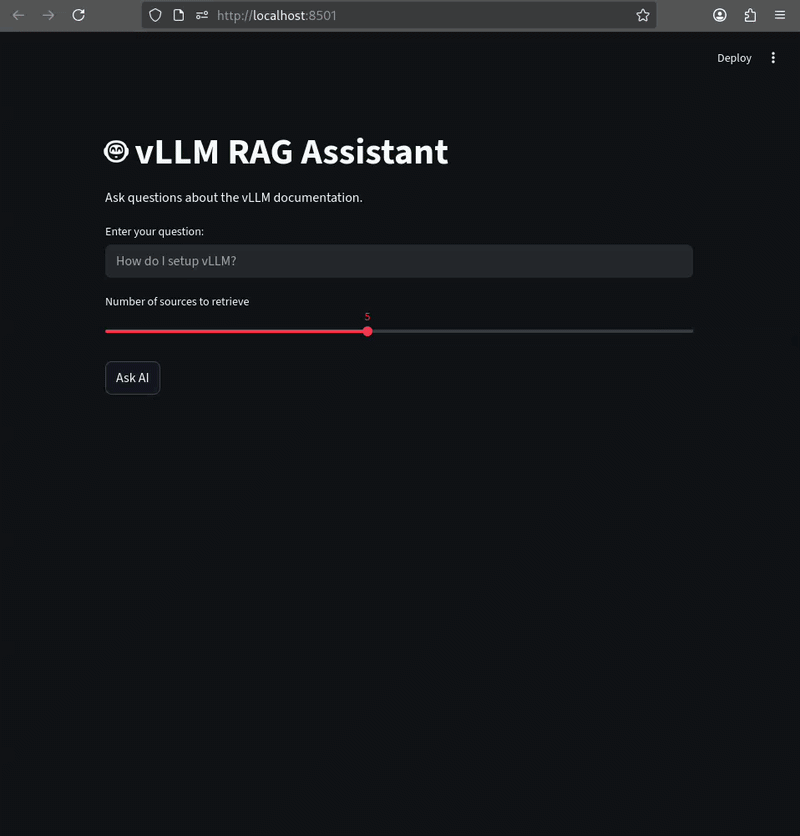

# RAG Against the Machine

*A 42 Prague curriculum project by sudas*

---

## Description

Retrieval-Augmented Generation (RAG) is an advanced information retrieval technique that goes beyond simple keyword matching. It combines chunking, lexical search, and semantic search to locate relevant document sections, then feeds those sections to a language model to generate a precise, sourced answer.

This project targets the [vLLM](https://github.com/vllm-project/vllm) GitHub repository. Given a natural language question, the system retrieves the most relevant chunks from vLLM's documentation and source code, and generates a grounded answer based on those sources. Performance is evaluated against 100 ground-truth question-answer pairs across both documentation and code datasets.



---

## Installation & Usage

### Setup
Prerequisites
Python 3.10+
UV: to manage dependencies.

Clone the repository and install all dependencies from the project root:

```bash
uv sync
```

### CLI Commands

```bash
# Index the document corpus
uv run python3 -m src index --max_chunk_size 1000

# Run a single search query
uv run python3 -m src search --query "what is vLLM" --k 10

# Run search over the full dataset
uv run python3 -m src search_dataset \
  --dataset_path "datasets_public/public/AnsweredQuestions/dataset_code_public.json" \
  --k 10 \
  --save_directory "data/output/sources.json"

# Answer a single question
uv run python3 -m src answer --question "what is vLLM?" --k 10

# Answer questions over the full dataset
uv run python3 -m src answer_dataset \
  --student_search_results_path "data/output/sources.json" \
  --save_directory "data/output/source_answers.json"

# Evaluate retrieval performance
uv run python3 -m src evaluate \
  --student_answer_path "data/output/sources.json" \
  --dataset_path "datasets_public/public/AnsweredQuestions/dataset_code_public.json" \
  --k 10
```

### Interactive Mode

Open two terminals from the project root and run:

```bash
# Terminal 1 — Frontend
source .venv/bin/activate
streamlit run src/frontend/app.py        # Serves on http://localhost:8501

# Terminal 2 — Backend
uv run uvicorn src.api.main:app --reload  # Serves on http://localhost:8000
```

Then open [http://localhost:8501](http://localhost:8501) in your browser.

---

## System Architecture

```
Documents → Chunking → Indexing (BM25 + ChromaDB) → Retrieval (Lexical + Semantic) → Augmentation → LLM Answer
```

The pipeline has four stages:

1. **Chunking** — Split raw documents into manageable segments
2. **Indexing** — Store chunks in both a lexical index (BM25) and a vector database (ChromaDB)
3. **Retrieval** — Query both indexes and merge results
4. **Augmentation** — Inject retrieved chunks into the LLM prompt to generate a grounded answer

---

## Chunking Strategy

Two chunking strategies are used depending on the source type:

- **Text chunking** — Applied to documentation files using LangChain's `RecursiveCharacterTextSplitter`
- **Program chunking** — Applied to source code files, respecting code structure boundaries

For chunks exceeding 500 characters, an overlap of 50 characters is applied between adjacent chunks. This preserves contextual continuity across chunk boundaries, which is particularly important for technical content where meaning often spans multiple sentences or code blocks.

---

## Retrieval Methods

### Lexical Search (BM25)

BM25 scores chunks based on keyword overlap with the query. It accounts for chunk length and down-weights common English words (e.g., "the", "in"). This method excels at finding exact terminology but degrades when the user's wording differs from the document's wording.

### Semantic Search (ChromaDB + `all-MiniLM-L6-v2`)

Chunks and queries are embedded into vector space using the `all-MiniLM-L6-v2` model. Retrieval is based on cosine similarity — the smaller the angle between query and chunk vectors, the better the match. Unlike BM25, semantic search handles paraphrasing and synonym variation, but its quality is bounded by the embedding model's capacity.

### Hybrid Search (RRF)

Results from BM25 and ChromaDB are merged using **Reciprocal Rank Fusion (RRF)**. Because the two methods use different scoring scales, RRF normalises them by rank position rather than raw score, then selects the top-k results from the combined pool of 4×k candidates.

### Hybrid Search with Cross-Encoder Re-ranking

An optional re-ranking stage uses a cross-encoder model to jointly score query–chunk pairs from the hybrid results. This is significantly slower (~10s vs ~1.3s) but improves Recall@1 noticeably, making it suitable for offline evaluation or high-precision use cases.

---

## Performance Analysis

Evaluation uses two metrics:
- **Recall@N** — Does the correct source appear in the top N results?
- **Overlap** — How much does the retrieved content overlap with the ground truth?

### Documentation Dataset (100 questions, chunk size 2000, overlap 50)

| Method | Recall@1 | Recall@3 | Recall@5 | Recall@10 | Latency |
|---|---|---|---|---|---|
| BM25 (Lexical) | 60.0% | 79.0% | 84.0% | 93.0% | ~0.25s |
| MiniLM-L6-v2 (Semantic) | 29.0% | 42.0% | 49.0% | 55.0% | ~1.2s |
| Hybrid RRF | 43.0% | 67.0% | 77.0% | 86.0% | ~1.35s |
| Hybrid + Cross-Encoder | 61.0% | 75.0% | 78.0% | 87.0% | ~10s |

### Code Dataset (100 questions, chunk size 2000, overlap 50)

| Method | Recall@1 | Recall@3 | Recall@5 | Recall@10 | Latency |
|---|---|---|---|---|---|
| BM25 (Lexical) | 29.0% | 48.0% | 54.0% | 57.0% | ~0.25s |
| MiniLM-L6-v2 (Semantic) | 19.0% | 28.0% | 37.0% | 48.0% | ~1.2s |
| Hybrid RRF | 27.0% | 44.0% | 53.0% | 67.0% | ~1.3s |
| Hybrid + Cross-Encoder | 38.0% | 57.0% | 61.0% | 67.0% | ~10s |

**Key observations:**
- BM25 dominates on documentation, where terminology is consistent and precise
- Semantic search underperforms on code, where variable names and function signatures are not well-represented in a general English embedding model
- Hybrid RRF improves code recall significantly over either method alone
- Cross-encoder re-ranking yields the highest Recall@1 at the cost of a 7–8× latency increase

### Embedding Models Under Consideration

| Model | Size | Strength | Status |
|---|---|---|---|
| `all-MiniLM-L6-v2` | ~80MB | General English | Current baseline |
| `bge-small-en-v1.5` | ~130MB | Massive retrieval benchmarks, technical docs | Planned |
| `nomic-embed-text-v1` | ~270MB | Long context (8k tokens) | Planned |
| `Qwen3-Embedding-0.6B` | ~600MB | Multilingual, strong general retrieval | Planned |

---

## Design Decisions

**Why chunk overlap?**
Splitting documents at fixed boundaries risks cutting a sentence or code block mid-thought. A 50-character overlap ensures that the tail of one chunk and the head of the next share context, reducing information loss at boundaries.

**Why hybrid search over pure semantic?**
Technical documentation and source code contain precise identifiers (function names, CLI flags, config keys) that benefit from exact keyword matching. Semantic search alone misses these. BM25 alone fails on paraphrased questions. Hybrid RRF captures both signals.

**Why RRF for merging?**
BM25 and ChromaDB produce scores on incompatible scales. RRF avoids the need to normalise or tune weights by operating purely on rank positions, making it robust and parameter-free.

**Why re-chunk retrieved results for answer generation?**
After retrieval, the top-k chunks may still contain noise. Re-chunking them into smaller segments and re-ranking allows the LLM to receive a shorter, denser, more relevant context — improving both answer accuracy and generation speed.

---

## Challenges & Planned Improvements

**Recall@1 for semantic search on code**
Code embeddings are a weak point for general-purpose English models. Planned fix: evaluate `bge-small-en-v1.5` and `nomic-embed-text-v1`, which are trained on more technical retrieval benchmarks.

**Answer generation latency**
LLM generation time scales with context length. Planned fix: after retrieval, re-chunk and re-rank results to pass only the most relevant, compact context to the model — reducing tokens while preserving accuracy.

---

## Resources

### Core Libraries & Tools

- [LangChain — Text Splitters](https://python.langchain.com/docs/concepts/text_splitters/) — `RecursiveCharacterTextSplitter` used for document chunking
- [ChromaDB Documentation](https://docs.trychroma.com/) — Vector database for semantic indexing and retrieval
- [Hugging Face — `all-MiniLM-L6-v2`](https://huggingface.co/sentence-transformers/all-MiniLM-L6-v2) — Embedding model used for semantic search
- [Hugging Face — `cross-encoder/ms-marco-MiniLM-L-6-v2`](https://huggingface.co/cross-encoder/ms-marco-MiniLM-L-6-v2) — Cross-encoder model used for re-ranking
- [rank-bm25](https://github.com/dorianbrown/rank_bm25) — BM25 implementation used for lexical retrieval
- [FastAPI](https://fastapi.tiangolo.com/) — Backend API framework
- [Streamlit](https://docs.streamlit.io/) — Frontend interface

### RAG Architecture References

- [Microsoft Azure — Design and Develop a RAG Solution](https://learn.microsoft.com/en-us/azure/architecture/ai-ml/guide/rag/rag-solution-design-and-evaluation-guide) — Comprehensive guide to RAG pipeline design, chunking strategies, and evaluation methodology
- [Applied AI — Enterprise RAG Architecture: A Practitioner's Guide](https://www.applied-ai.com/briefings/enterprise-rag-architecture/) — In-depth coverage of hybrid search, RRF, cross-encoder re-ranking, and production RAG patterns
- [Medium — Building Production-Ready RAG Systems](https://medium.com/@meeran03/building-production-ready-rag-systems-best-practices-and-latest-tools-581cae9518e7) — Best practices for RAG systems using LangChain, LlamaIndex, vector databases, and evaluation strategies (2024–2025)
- [Lewis et al. (2020) — Retrieval-Augmented Generation for Knowledge-Intensive NLP Tasks](https://arxiv.org/abs/2005.11401) — Original RAG paper from Facebook AI Research

---

## Future Plans
 
**Query Expansion**
Currently, the system searches using the user's question exactly as typed. The planned improvement is to generate 2–3 reformulated variants of the question — either by injecting synonyms or by prompting an LLM to rephrase it — before running retrieval. Each variant is searched independently and the results are merged. This directly targets BM25's weakness: if the user's wording differs from the document's wording, lexical search misses the match. Query expansion increases the surface area of the search without changing the underlying retrieval infrastructure.
 
**Question Caching**
Repeated or semantically similar questions should not trigger a full retrieval and LLM generation cycle every time. The plan is to store previously answered questions in the vector database alongside their answers and a unique ID. When a new question arrives, it is first compared against cached questions using semantic similarity. If a sufficiently close match is found, the cached answer is returned directly — bypassing both retrieval and LLM inference. This solves two problems simultaneously: it eliminates redundant LLM calls (reducing cost and latency), and it ensures that similar questions always receive consistent answers rather than slightly different generations.
 
**vLLM Inference Backend**
vLLM's PagedAttention mechanism optimises GPU memory management for inference, enabling higher throughput and lower latency when serving multiple concurrent requests. This would make the system fully self-contained and significantly faster for batch answer generation.
 
---

## AI Usage Disclosure

In accordance with 42 Prague guidelines, AI assistance was used for the following:
- Understanding RAG concepts and retrieval design patterns
- Generating docstrings for Python modules
- Polishing this README file
- Generating the Streamlit frontend interface

All core pipeline logic — chunking, indexing, retrieval, evaluation, and API design — was implemented by the student.
